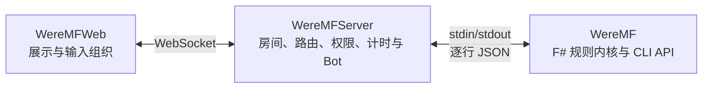

# WereMF

MF 杀是由 [Mario Forever 社区](https://www.marioforever.net) 的大爷、xfx 等众多玩家共同设计的类狼人杀游戏；本仓库包含规则内核、联网服务和 Web 客户端。

- [`WereMF`](WereMF/README.md)：稳定的 F# CLI 规则内核与完整 CLI API 文档。
- [`WereMFServer`](WereMFServer/README.md)：多人房间、WebSocket 转发、计时器和 Bot 托管服务。
- [`WereMFWeb`](WereMFWeb/README.md)：浏览器客户端、构建方式和 Web 回归样例。

## 职责边界

CLI 是角色规则与结算的唯一来源；Server 只协调进程、会话和网络消息；Web 只合并服务端状态、展示结果并组织输入，不复制角色规则。

## 确定性验证

- `dotnet run --project WereMFServer.Tests -c Release`：运行不依赖外部模型或网络的 Server night patch 协议边界测试。
- `npm --prefix WereMFWeb test`：运行 Web 字段级 patch 合并测试。
- `node test/run-deterministic.mjs`：构建 solution、发布 F# CLI 与假 CLI，并串行运行 Server/Web、路由、权限、重连、预提交、房间生命周期和 Web 事件回归；该入口不需要 LLM 或外部网络。
- `node test/run-deterministic.mjs --replay`：额外启动本地 Server 回放三份历史日志并检查 UI 终态；报告同时给出 `exact` 与兼容回退状态。历史日志若与当前规则版本不兼容，会明确失败，不影响核心 deterministic runner。

环境要求：.NET 8 SDK、Node.js（含内置 `node:test`）和 npm。LLM 回归另行使用 `test/llm_bot_game.mjs`，需要显式配置模型测试环境，不属于默认验证。
